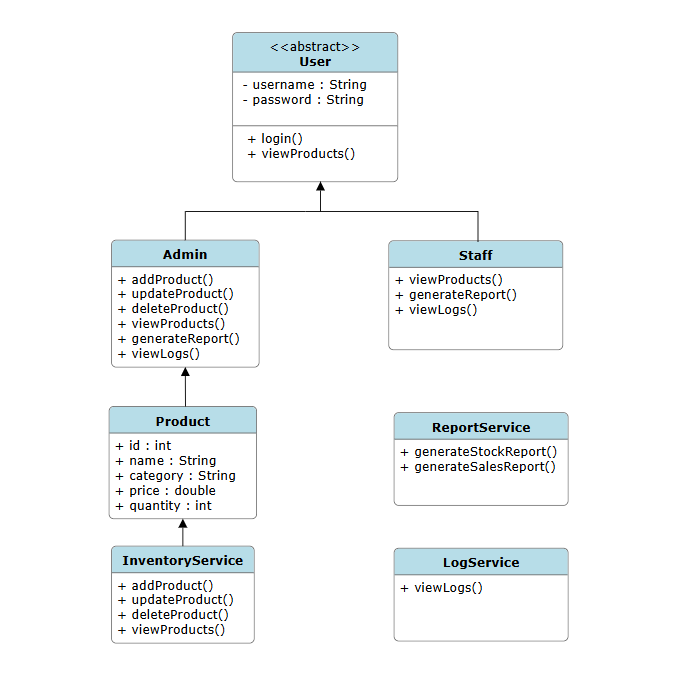
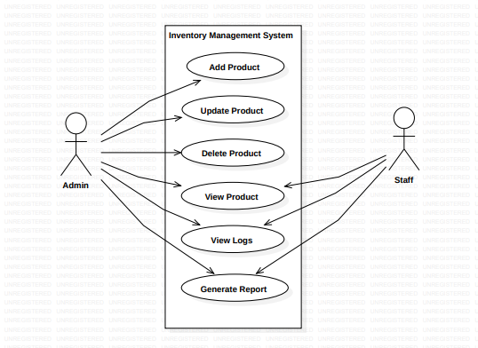

# Retail Inventory Management System

## Problem Statement
Retail shops face challenges in managing their inventory effectively:
- Difficulty in tracking available stock  
- Errors in manual updates of product details  
- Lack of proper reporting for decision-making  
- No role-based access to separate admin and staff operations  
- No way to track previous CRUD activity for accountability  

To solve these issues, we need a simple, secure, and role-based **Inventory Management System**.

---

## Project Description
The **Retail Inventory Management System** is a **console-based Java application** built using **JDBC and MySQL**.  
It allows shop owners and staff to efficiently manage inventory with features like:

- **Role-based login**  
  - **Admin:** Can add, update, delete, and view products, as well as generate reports and view logs  
  - **Staff:** Can only view stock levels, generate reports, and view logs  

- **Product Management (CRUD)**  
  - Add new products  
  - Update existing products (name, price, category, or any combination)  
  - Delete products  
  - Search and display all products  

- **Logs Management**  
  - Tracks all CRUD operations performed by Admins and Staff  
  - Logs stored in MySQL database  
  - Both Admin and Staff can view operation history for accountability  

- **Report Generation**  
  - Stock report (current stock levels)  
  - Sales report (product sales history)  
  - Reports can be exported as `.txt` files  

The system ensures **data consistency** using a **MySQL database** and demonstrates **OOP principles** like inheritance, abstraction, and runtime polymorphism.

---

## Tech Stack
- **Programming Language:** Java  
- **Database:** MySQL  
- **Connectivity:** JDBC (Java Database Connectivity)  
- **IDE:** Visual Studio Code  
- **Version Control:** Git & GitHub  
- **Reports:** Exported as `.txt` files  
- **Compilation and Run Command:** Execute `run.bat` in Command Prompt  

---
## UML Class Diagram

## Use Case Diagram

